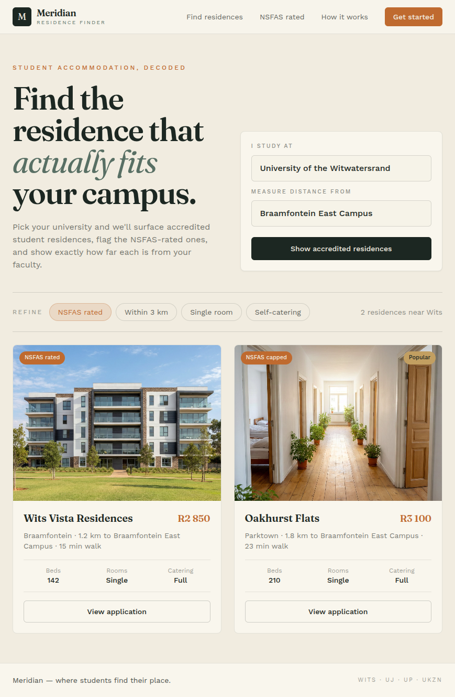
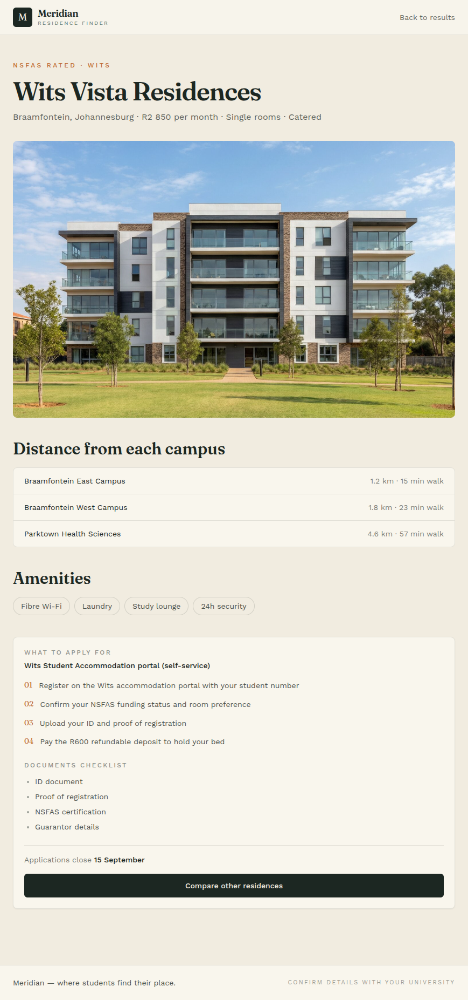

# Meridian — Residence Finder

A web app that helps students at South African universities find accredited residences that actually fit their campus — with NSFAS ratings, monthly prices, walking distance to the exact campus they attend, and the application steps and documents each residence needs.

Rebuilt as a standalone React app from the original Lovable project ([resy-finder.lovable.app](https://resy-finder.lovable.app)).





## Features

- **Campus-first search** — pick your university (Wits, UJ, UP, UKZN) and the campus you actually attend; every distance is measured from that campus
- **Refine filters** — NSFAS rated (on by default), Within 3 km, Single room and Self-catering; results update live with a result count and an empty state
- **Residence cards** — photo, NSFAS badge (rated / capped / private lease), Popular badge, price per month, suburb, distance, walk time, beds, room type and catering
- **Residence detail pages** — distance table for every campus, amenities, the application portal, numbered application steps, a documents checklist and the closing date
- **How it works** — explains accreditation and what NSFAS rated, capped and private lease mean

## Tech stack

| Layer    | Choice                                                                              |
| -------- | ----------------------------------------------------------------------------------- |
| UI       | React 18 + TypeScript                                                               |
| Build    | Vite 5                                                                              |
| Styling  | Tailwind CSS 3 with custom tokens (`ink`, `cream`, `paper`, `terra`, `sage`, `gold`) |
| Routing  | React Router 6                                                                      |
| Fonts    | Fraunces (display) + Work Sans (body)                                               |

There is no backend — all residence data lives in [`src/data/residences.ts`](src/data/residences.ts) as typed mock data.

## Getting started

Requirements: Node.js 18+ and npm.

```bash
npm install
npm run dev        # start the dev server at http://localhost:5173
npm run build      # type-check and build for production
npm run preview    # preview the production build
```

## Project structure

```
src/
  data/residences.ts        # universities, residences, helpers (price/status formatting)
  components/
    SiteHeader.tsx          # logo + per-page right-hand slot
    SiteFooter.tsx          # shared footer with per-page note
    ResidenceCard.tsx       # result card with badges and stats
  pages/
    Home.tsx                # hero, search form, refine filters, results grid
    ResidenceDetail.tsx     # per-campus distances, amenities, apply sidebar
    HowItWorks.tsx          # four-step explainer
  index.css                 # design tokens as oklch() CSS variables
public/images/              # residence photos
```

## Data model

Universities define their campuses (used as distance baselines). Each residence carries everything a student needs to decide and apply:

```ts
interface Residence {
  slug: string                  // route: /residence/:slug
  name: string
  university: 'wits' | 'uj' | 'up' | 'ukzn'
  suburb: string
  city: string
  pricePerMonth: number
  roomType: 'Single' | 'Sharing' | 'Double'
  catering: 'full' | 'self'
  nsfas: 'rated' | 'capped' | 'private'
  popular?: boolean
  beds: number
  image: string
  distances: { campus: string; km: number; walkMin: number }[]
  amenities: string[]
  portal: string
  steps: string[]
  documents: string[]
  closes: string
}
```

To add a residence, append an entry to `residences` in `src/data/residences.ts` — the home results, filters and detail page pick it up automatically.

## Notes

- The listing data is mock data for demonstration; confirm details with each university before applying.
- Residence photos are AI-generated placeholders.
- Design tokens use the CSS `oklch()` color space (supported by all modern browsers).
